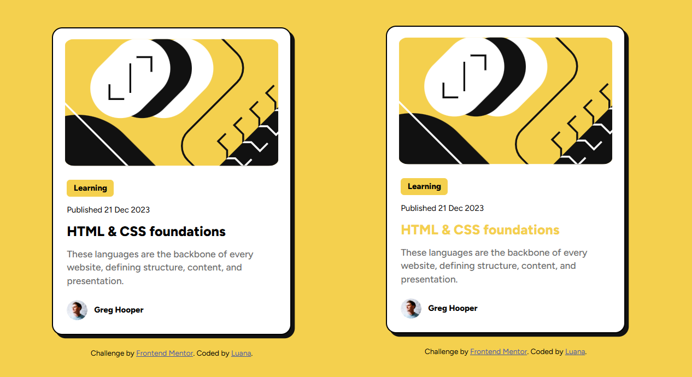

# Blog Preview Card

Projeto desenvolvido a partir de um desafio do [Frontend Mentor](https://www.frontendmentor.io/), com o objetivo de reproduzir um card de prévia de artigo utilizando HTML e CSS.

## 📸 Preview

## 🛠️ Tecnologias

* HTML5
* CSS3
* Flexbox
* CSS `clamp()`
* Figtree

## 📚 O que pratiquei

* Estruturação semântica com HTML
* Organização e estilização com CSS
* Flexbox
* Responsividade
* Tipografia e espaçamento
* Uso de variáveis CSS
* Uso de `clamp()` para adaptação dos tamanhos de fonte
* Estados de `hover`

## 🎨 Design

O projeto foi desenvolvido seguindo o layout e o guia de estilos fornecidos pelo desafio do Frontend Mentor.

## 👩‍💻 Autora

Luana

[GitHub](https://github.com/luanarb)
